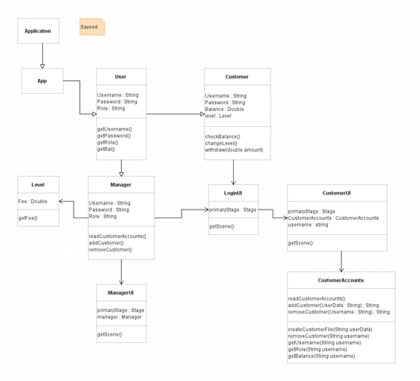

# Bank Account App

The Bank Account App is a user-friendly banking application built with JavaFX. It supports two types of users—Managers and Customers—and provides essential banking functionalities such as logging in, depositing and withdrawing money, checking balances, and making online purchases. The application categorizes customers into three levels (Silver, Gold, Platinum), each with distinct features and fees.

## Features

- **Login System**: Secure login for both Customers and Managers.
- **Customer Functions**: Deposit, withdraw, check balance, and make online purchases.
- **Manager Functions**: Add or remove customers, manage customer accounts.
- **Customer Levels**: Silver, Gold, and Platinum levels with specific features and fees.
- **Security**: Ensures only authorized users can access their respective functionalities.

## Diagrams

### Use Case Diagrams

- **Diagram #2: Final UML Use Case**

  <!-- Add image reference here -->

### Class Diagrams

- **Diagram #4: Final UML Class**

  <!-- Add image reference here -->

## Design Details

### Level Class

The `Level` class represents different customer tiers (Silver, Gold, Platinum) with fixed fees for online purchases. It is immutable, meaning once defined, it remains unchanged. 

- **Abstraction Function**: Maps enum constants to customer levels with associated fees.
- **Rep Invariant**: Ensures that all fee values are non-negative.

### LoginUI Class and Design Patterns

- **LoginUI Class**: Manages user login and directs them to either `CustomerUI` or `ManagerUI` based on their roles. It sets up the main screen for user login.

- **State Design Pattern**: Implemented in the `Level` class, demonstrating different customer states (SILVER, GOLD, PLATINUM) and how available actions depend on the current state.

## Getting Started

1. **Clone the Repository**: `git clone https://github.com/yourusername/bank-account-app.git`
2. **Navigate to the Project Directory**: `cd bank-account-app`
3. **Build the Project**: Follow the instructions in the build tool used (e.g., Maven or Gradle).
4. **Run the Application**: Execute the main class or follow specific run instructions.

## References

- [Violet UML Editor](http://alexdp.free.fr/violetumleditor/page.php) - For UML diagram creation.
- [JavaFX GUI Tutorials](https://www.youtube.com/playlist?list=PL6gx4Cwl9DGBzfXLWLSYVy8EbTdpGbUIG) - Video tutorials for JavaFX.
- [Toronto Metropolitan University Course Content](https://courses.torontomu.ca/d2l/le/content/839005/viewContent/5644040/View) - Additional course material.

## License

This project is licensed under the MIT License - see the [LICENSE](LICENSE) file for details.

## Contact

For questions or feedback, please contact [Your Name](mailto:your.email@example.com).
